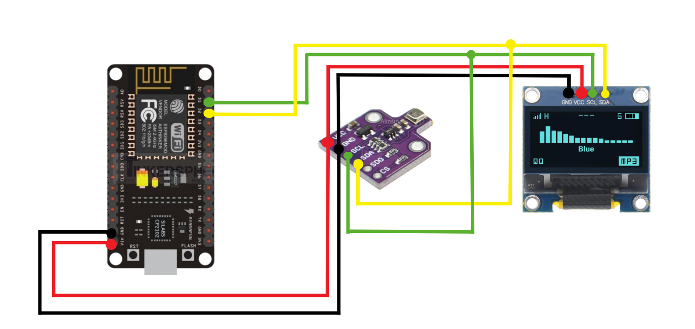
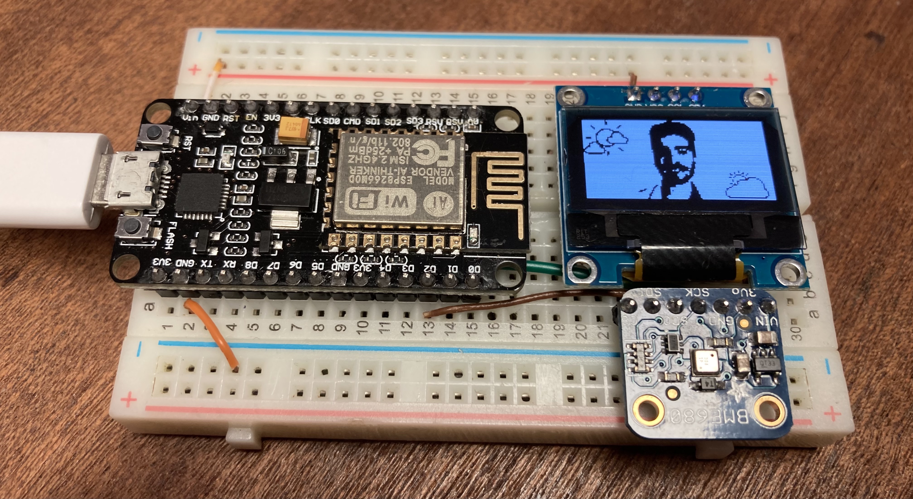
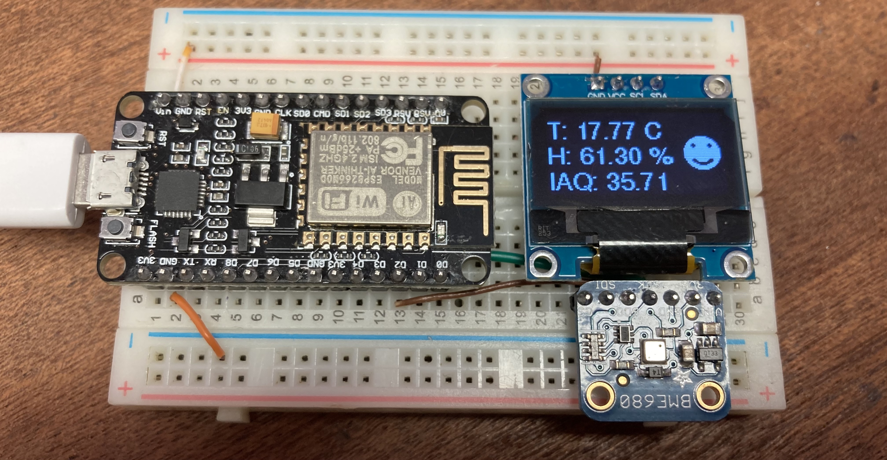
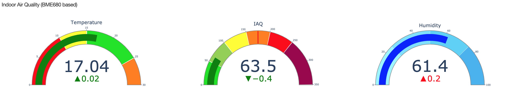

# IAQ-Monitor-ESP8266
## DIY of an IAQ monitor with a cost less than 20€

### Required Hardware (Total at 21/03/21 = 20,12€):
 - 1 x [NodeMcu v2 ESP-12E CP2102 - 3€](https://www.aliexpress.com/item/4001278785276.html)
 - 1 x [BME680 - 12,15€](https://www.aliexpress.com/item/1005002160383620.html)
 - 1 x [0.96" White OLED 128X64 Display - 2,66€](https://www.aliexpress.com/item/32643950109.html)
 - 1 x [BreadBoard - 1,32€](https://www.aliexpress.com/item/32671276515.html)
 - 1 x [10 Male-Male Jumper Wire - 0,99€](https://www.aliexpress.com/item/32891879068.html)

### Required Software:
 - Vscode
 - Platformio
 - Python3 with pip

### DIY Procedure:
 - Installing VScode: https://www.youtube.com/watch?v=MlIzFUI1QGA
 - Installing Platformio: https://platformio.org/install/ide?install=vscode
 - Installing Python3 with Pip: https://www.youtube.com/watch?v=V_ACbv4329E
 - Setup the hardware:
    - How to use a breadboard: https://www.youtube.com/watch?v=6WReFkfrUIk
    - Connect all the hardware parts like the diagram below:
      <br>
 - Setup the software (https://www.youtube.com/watch?v=WIRp1SgIaoo):
    - Download this repo as a zip file
    - Plug the NodeMcu board into your computer
    - Open vscode and then go to platformio and click import project and import the unzipped folder that you have download before
    - Go to ``` src ``` folder and open the ``` main.cpp ``` file
    - Update lines 64 and 65 to match your home WiFi credentials
    - Hit the flash software button
    - Done! The board should turn on without any problems and start displaying the IAQ values
 - Setup GUI:
    - Open your command prompt and go to the unzipped folder downloaded before
    - Install the required packages using pip: ``` pip3 install requirements.txt ```
    - Start the mqttClient.py by running: ``` python3 mqttClient.py ```
    - Start the dash.py by running: ``` python3 dash.py ```
    - Go to your default browser and enter the following address: ``` http://127.0.0.1:8050/ ``` and you are ready to go!

##### Media:
   
  <br>
  
